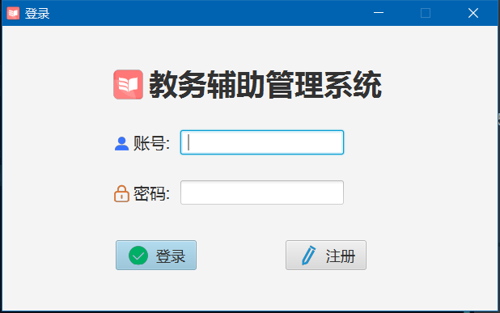
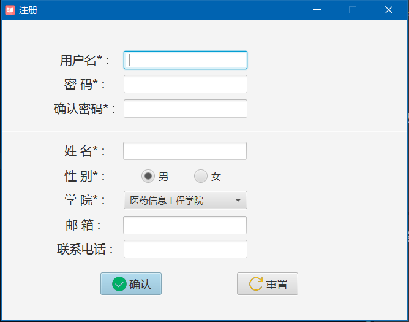
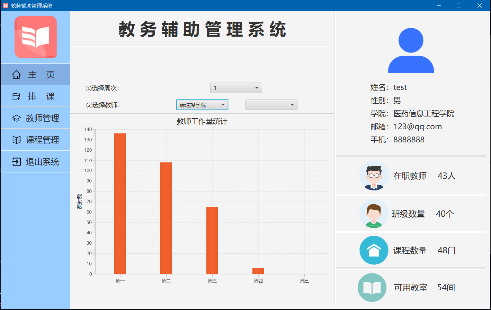
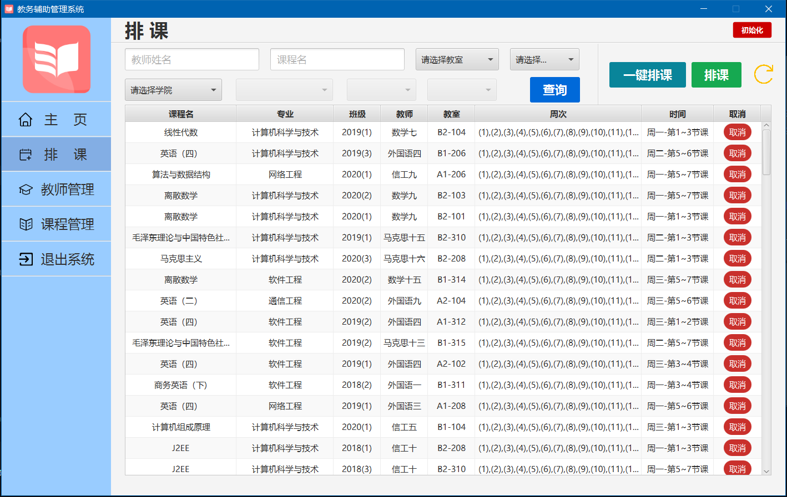
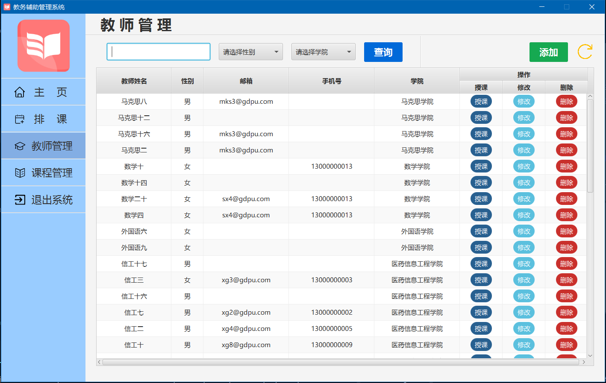
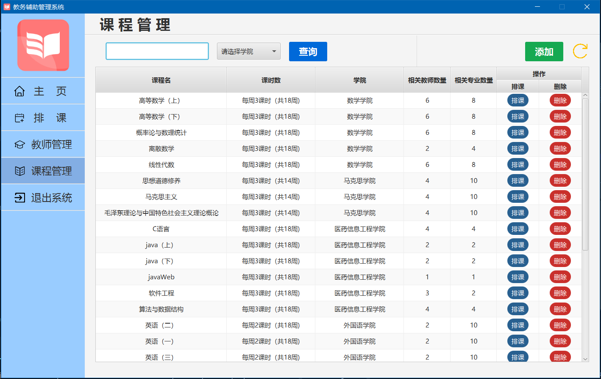

# 教务辅助管理系统（JavaFX版）

<b>功能需求：</b>
1. 注册与登录：
    - 用户可以注册账号，登录系统后进入界面，实现相应功能。

2. 教师管理：
    - 添加教师：登录之后，可以将新入职的教师录入到系统的教师表中。
    - 修改教师信息：可以从教师表中选择需要修改的教师，对其基本信息修改。
    - 删除教师：登录之后，可以删除已离职或退休的教师。
    - 搜索教师：可以根据教师基本信息搜索教师。
    - 安排授课：可以查看教师的所授课程，对其进行增加、删除。
    
3. 课程管理：
    - 添加课程：登录之后，可以将新增加的课程录入到系统的课程表中。
    - 删除课程：登录之后，可以删除已取消的课程。
    - 搜索课程：可以根据课程的基本信息搜索课程。
    - 安排课程：可以查看课程的在各个专业学习路线的计划，对其进行增加、减少。

4. 排课：
    - 手动排课：登录之后，可以手动调整班级课程。
    - 自动排课：登录之后，系统可以根据系统相关数据，自动对班级排课。

5. 数据统计：
    - 计算工作量：登录之后，可以将新增加的课程录入到系统的课程表中。
    - 对系统相关数据统计：登录之后，可以删除已取消的课程。

-------

<b>项目部分截图：</b>

